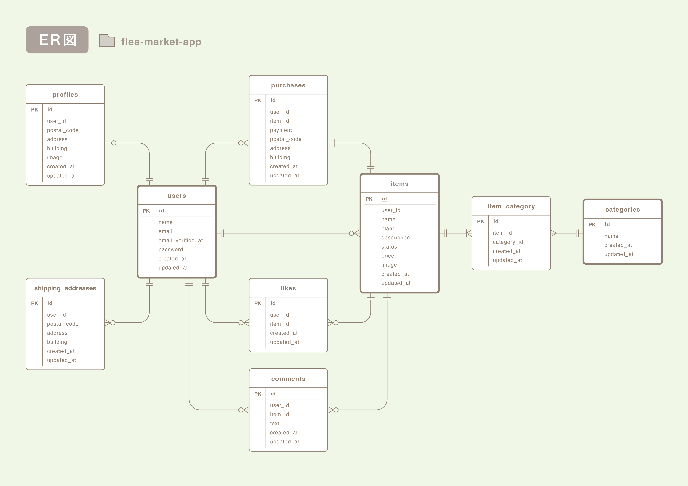

# flea-market-app (coachtechフリマ)

## 環境構築

### Dockerビルド

1. GitHubからクローン。
``` bash
git clone git@github.com:hayakawajun/mock.git
```
2. DockerDesktopアプリを立ち上げる。
3. Dockerを起動。
``` bash
docker-compose up -d --build
```
※ MySQLはOSによって起動しない場合があるので、それぞれのPCに合わせてdocker-compose.ymlファイルを編集してください。

### Laravel環境構築

1. PHPコンテナ内に移動。
``` bash
docker-compose exec php bash
```
2. パッケージのインストール。
``` bash
composer install
```
3. 「.env.example」ファイルをコピーして「.env」ファイルを作成。
``` bash
cp .env.example .env
```

4. 作成した「.env」ファイルに以下の環境変数を設定。

- データベースに関する設定
``` text
DB_CONNECTION=mysql
DB_HOST=mysql
DB_PORT=3306
DB_DATABASE=laravel_db
DB_USERNAME=laravel_user
DB_PASSWORD=laravel_pass
```
- mailhogによるメール認証テストに関する設定
``` text
MAIL_MAILER=smtp
MAIL_HOST=mailhog
MAIL_PORT=1025
MAIL_USERNAME=null
MAIL_PASSWORD=null
MAIL_ENCRYPTION=null
MAIL_FROM_ADDRESS=test@example.com
MAIL_FROM_NAME="${APP_NAME}"
```
- 下記はStripeのテスト決済画面への接続に関する設定です。  
ファイル内に項目を追加の上、設定してください。
``` text
STRIPE_KEY="あなたのテスト公開可能キーをここに記述"
STRIPE_SECRET="あなたのテストシークレットキーをここに記述"
```
> *Stripeキーについて：キーの値はStripeのテスト用サンドボックス画面に入り、[開発者]アイコンから[APIキー]押下で遷移後、テスト用のAPIキーをそれぞれコピーして上記項目に貼り付けてください。*

5. アプリケーションキーの作成。
``` bash
php artisan key:generate
```

6. 最新の「.env」ファイルの設定を有効にするためコマンドを実行。
``` bash
php artisan config:clear
```

7. 画像ファイルの保存先をstorageディレクトリにするためストレージリンクを作成。
``` bash
php artisan storage:link
```

8. マイグレーションの実行。
``` bash
php artisan migrate
```

9. シーディングの実行
``` bash
php artisan db:seed
```
> *シーディングファイルについて：商品のダミーデータを作成するにあたり、ダミー商品を出品したダミーユーザーも2名作成しています。また、そのユーザーのプロフィール、コメント、いいね、購入情報のシーディングファイルも設定していますが、機能の検証に邪魔な場合は「DatabaseSeeder.php」ファイル内の「ProfilesTableSeeder」「CommentsTableSeeder」「LikesTableSeeder」「PurchasesTableSeeder」のそれぞれのクラスをコメントアウトして下さい。またこのREADME.mdと同階層にダミーデータの簡単な相関図を配置しているので、よろしければご参照ください。*


## phpunitを使用したテストについて

### テスト環境構築

1. PHPコンテナ内に移動。
``` bash
docker-compose exec php bash
```

2. 「.env.example」ファイルをコピーして「.env.testing」ファイルを作成。
``` bash
cp .env.example .env.testing
```

3. 作成した「.env.testing」ファイルに以下の環境変数を設定。

- アプリケーションに関する設定
``` text
APP_NAME=Laravel
APP_ENV=test
APP_KEY=
APP_DEBUG=true
APP_URL=http://localhost
```
- データベースに関する設定
``` text
DB_CONNECTION=mysql
DB_HOST=mysql
DB_PORT=3306
DB_DATABASE=demo_test
DB_USERNAME=root
DB_PASSWORD=root
```
- mailhogによるメール認証テストに関する設定
``` text
MAIL_MAILER=smtp
MAIL_HOST=mailhog
MAIL_PORT=1025
MAIL_USERNAME=null
MAIL_PASSWORD=null
MAIL_ENCRYPTION=null
MAIL_FROM_ADDRESS=test@example.com
MAIL_FROM_NAME="${APP_NAME}"
```

4. テスト用のアプリケーションキーの作成。
``` bash
php artisan key:generate —-env=testing
```

6. 最新の「.env.testing」ファイルの設定を有効にするためコマンドを実行。
``` bash
php artisan config:clear
```

7. テスト用のテーブルを作成。
``` bash
php artisan migrate —-env=testing
```

### テストファイルについて
tests/Feature ディレクトリ以下に,
テスト項目に合わせて 16 のテストファイルを作成しています。  
それぞれのファイル内に、テスト内容をコメントアウトしていますのでご参照ください。

## 使用技術(実行環境)

- PHP 8.2.29
- Laravel 8.83.29
- MySQL 8.0.26
- nginx 1.21.1

## 使用技術(フロントエンド)

- HTML/CSS
- JavaScript (一部ビューファイルで、入力値を即時反映するなどの理由で使用しています。)

## ER図



## 開発環境(URL)
- トップページ：http://localhost/
- ユーザー登録：http://localhost/register
- phpMyAdmin：http://localhost:8080/
- mailhog：http://localhost:8025/